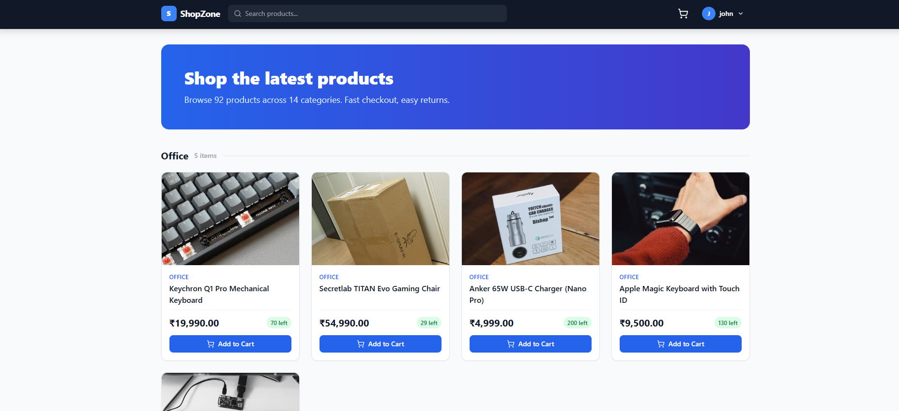
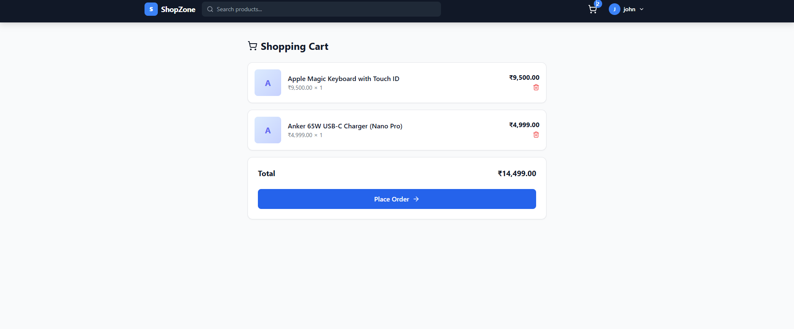
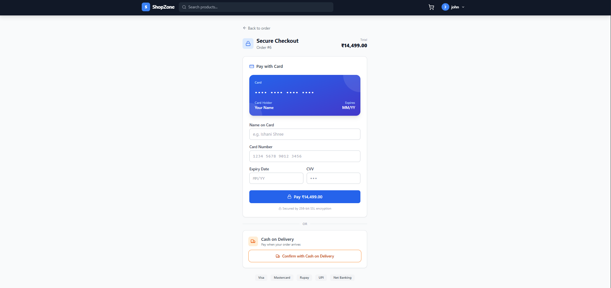
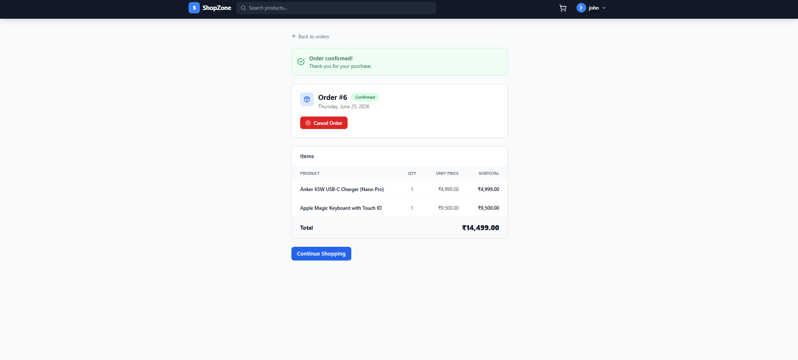
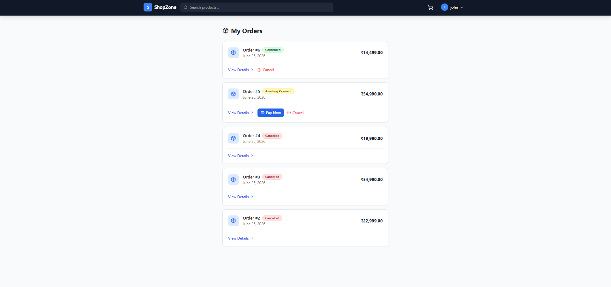

# ShopZone — Full-Stack E-Commerce Platform

A production-style e-commerce web app built with **Node.js + Express**, **PostgreSQL**, and **React + Vite**. Features 92 real products across 14 categories, JWT auth, a simulated payment gateway, order management, and real-time location-based currency conversion.

---

## Screenshots

### Product Dashboard


### Shopping Cart


### Secure Checkout — Card & Cash on Delivery


### Order Confirmation & Detail


### Order List with Status Badges



---

## Features

- **92 products** across 14 categories (Smartphones, Laptops, Audio, Gaming, Fashion, Books, and more)
- **JWT authentication** — register, login, protected routes, role-based access (user / admin)
- **Shopping cart** — add, remove, live item count badge in navbar
- **Payment simulation** — animated card form (Visa / Mastercard / Rupay / UPI) + Cash on Delivery option
- **Order management** — place, confirm, and cancel orders with stock restoration
- **Order status badges** — Awaiting Payment · Confirmed · Cancelled
- **Real-time currency** — IP geolocation detects country → live exchange rate → `Intl.NumberFormat` display (defaults to ₹ INR)
- **Admin panel** — add / edit / delete products
- **Single start command** — `npm run dev` at root boots both servers via `concurrently` + `nodemon`

---

## Tech Stack

| Layer | Technology |
|---|---|
| Backend | Node.js, Express.js 5, CommonJS |
| Database | PostgreSQL via `pg` connection pool |
| Auth | JWT (1-day expiry) + bcryptjs (salt 10) |
| Frontend | React 18, Vite 5, Tailwind CSS 3 |
| Routing | React Router v6, protected routes |
| HTTP | Axios + request interceptor (Bearer token) |
| CORS | Vite dev proxy `/api` → `localhost:5000` |
| Currency | ipwho.is (geolocation) + open.er-api.com (exchange rates) |
| Images | loremflickr.com (keyword + lock param for determinism) |
| Dev tools | concurrently, nodemon |

---

## Project Structure

```
ecommerce-platform/
├── backend/
│   ├── src/
│   │   ├── config/
│   │   │   ├── db.js              # PostgreSQL pool
│   │   │   ├── schema.sql         # DB schema (5 tables)
│   │   │   └── seed.js            # 92 products seeder
│   │   ├── controllers/
│   │   │   ├── authController.js
│   │   │   ├── productController.js
│   │   │   ├── cartController.js
│   │   │   └── orderController.js
│   │   ├── middleware/
│   │   │   ├── authMiddleware.js  # JWT protect
│   │   │   └── adminMiddleware.js
│   │   ├── routes/
│   │   │   ├── authRoutes.js
│   │   │   ├── productRoutes.js
│   │   │   ├── cartRoutes.js
│   │   │   └── orderRoutes.js
│   │   └── server.js
│   ├── .env
│   └── package.json
├── frontend/
│   ├── src/
│   │   ├── api/index.js           # Axios instance + all API calls
│   │   ├── context/
│   │   │   ├── AuthContext.jsx
│   │   │   ├── CartContext.jsx
│   │   │   └── CurrencyContext.jsx
│   │   ├── pages/
│   │   │   ├── Home.jsx
│   │   │   ├── ProductDetail.jsx
│   │   │   ├── Cart.jsx
│   │   │   ├── PaymentPage.jsx
│   │   │   ├── Orders.jsx
│   │   │   ├── OrderDetail.jsx
│   │   │   ├── Login.jsx
│   │   │   ├── Register.jsx
│   │   │   └── AdminPanel.jsx
│   │   ├── components/
│   │   │   ├── Navbar.jsx
│   │   │   ├── ProductCard.jsx
│   │   │   ├── ProtectedRoute.jsx
│   │   │   └── Toast.jsx
│   │   ├── App.jsx
│   │   └── main.jsx
│   └── package.json
├── visuals/                       # Screenshots
├── package.json                   # Root — concurrently dev script
└── README.md
```

---

## Getting Started

### Prerequisites

- Node.js 18+
- PostgreSQL 14+

### 1 — Clone & install

```bash
git clone https://github.com/your-username/ecommerce-platform.git
cd ecommerce-platform
npm run install:all
```

### 2 — Configure the database

Create a PostgreSQL database named `ecommerce`, then run the schema:

```bash
psql -U postgres -d ecommerce -f backend/src/config/schema.sql
```

### 3 — Environment variables

Create `backend/.env`:

```env
PORT=5000
DB_USER=postgres
DB_HOST=localhost
DB_NAME=ecommerce
DB_PASSWORD=your_password
DB_PORT=5432
JWT_SECRET=your_jwt_secret
```

### 4 — Seed the database

```bash
cd backend
npm run seed
```

This inserts 92 products across 14 categories with INR prices and loremflickr images.

### 5 — Start both servers

```bash
cd ..        # back to root
npm run dev
```

- Backend (nodemon): `http://localhost:5000`
- Frontend (Vite): `http://localhost:5173`

---

## API Reference

### Auth
| Method | Endpoint | Description |
|---|---|---|
| POST | `/api/auth/register` | Register new user |
| POST | `/api/auth/login` | Login → returns JWT |

### Products
| Method | Endpoint | Description |
|---|---|---|
| GET | `/api/products?page=1&limit=200` | List products |
| GET | `/api/products/search?q=iphone` | Search |
| GET | `/api/products/:id` | Product detail |
| POST | `/api/products` | Create (admin) |
| PUT | `/api/products/:id` | Update (admin) |
| DELETE | `/api/products/:id` | Delete (admin) |

### Cart
| Method | Endpoint | Description |
|---|---|---|
| GET | `/api/cart` | Get cart items |
| POST | `/api/cart/add` | Add to cart |
| DELETE | `/api/cart/remove/:id` | Remove item |

### Orders
| Method | Endpoint | Description |
|---|---|---|
| POST | `/api/orders/checkout` | Create order (`pending_payment`) |
| POST | `/api/orders/pay` | Confirm payment → `confirmed` |
| POST | `/api/orders/cancel` | Cancel order + restore stock |
| GET | `/api/orders` | List user orders |
| GET | `/api/orders/:id` | Order detail |

---

## Database Schema

```sql
users        — id, name, email, password, role
products     — id, name, description, price, stock, category, image_url
cart_items   — id, user_id, product_id, quantity
orders       — id, user_id, total_price, status, created_at
order_items  — id, order_id, product_id, quantity, price
```

**Order statuses:** `pending_payment` · `confirmed` · `cancelled`

---

## Payment Flow

```
Cart → Place Order → Order created (pending_payment)
     → /payment/:id
          ├── Pay with Card  (2.8s simulated processing) → confirmed
          └── Cash on Delivery (1.2s)                   → confirmed

Order Detail / Orders List
     └── Cancel Order → cancelled + stock restored
```


